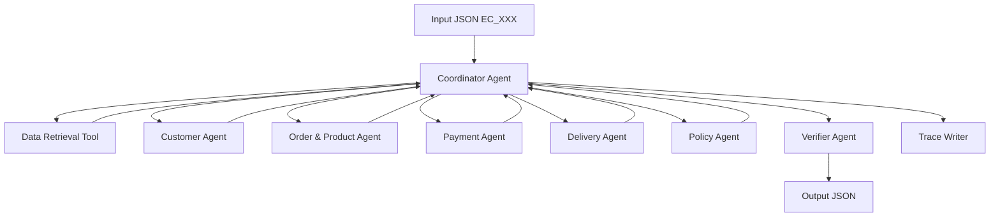

# Multi-Agent E-commerce Dispute Resolution Architecture

## 1. Muc tieu

He thong xu ly 50 case khieu nai Olist tu `input/EC_001.json` den
`input/EC_050.json`. Moi case duoc truy xuat du lieu tu 9 file CSV trong
`data/`, phan tich boi cac agent chuyen trach, ap dung `EC_POLICY_V2`, kiem
tra schema va ghi ket qua vao `output/EC_XXX.json`.

## 2. Thanh phan chinh



## 3. Vai tro cua 7 agent

### Coordinator Agent

- Doc case tu `input/`.
- Lay `claimed_order_id`.
- Goi Data Retrieval Tool de thu thap evidence tu CSV.
- Dieu phoi evidence den cac agent chuyen trach.
- Tong hop ket qua va ghi output neu Verifier Agent chap nhan.

### Customer Agent

- Nhan customer row va danh sach order cung `customer_unique_id`.
- Suy luan `customer_unique_id`, `related_order_ids`, `repeat_customer`.
- Khong dua order lich su vao `affected_entities`.

### Order & Product Agent

- Nhan item rows, product rows va bang dich category.
- Suy luan item IDs, seller IDs, product IDs, category names.
- Xac dinh cac secondary issue lien quan: `multi_item_order`,
  `multi_seller_order`, `multiple_categories`.

### Payment Agent

- Nhan item rows va payment rows.
- Suy luan/tinh:
  - `item_total_brl`
  - `freight_total_brl`
  - `expected_total_brl`
  - `payment_total_brl`
  - `difference_brl`
  - `reconciled`
  - `split_payment`

### Delivery Agent

- Nhan order timestamps va shipping limit cua tung seller.
- Suy luan/tinh:
  - `delivery_variance_hours`
  - `handoff_variance_hours`
  - seller nao handoff tre
  - order co giao tre hon estimated date hay khong

### Policy Agent

- Nhan ket qua cua Customer, Order/Product, Payment va Delivery.
- Ap dung `EC_POLICY_V2` theo dung thu tu uu tien:
  1. `canceled_order_paid`
  2. `unavailable_order_paid`
  3. `late_delivery_seller`
  4. `late_delivery_logistics`
  5. `valid_split_payment`
  6. `unsupported_late_claim`
- Tra ve primary issue, secondary issues, root cause, responsible parties,
  refund, evidence IDs va actions.

### Verifier Agent

- Kiem tra output cuoi cung truoc khi ghi file.
- Xac minh:
  - JSON dung schema;
  - confidence nam trong `[0, 1]`;
  - evidence ID dung format;
  - cac array khong vuot gioi han;
  - `case_status` khop voi refund.

## 4. Data Retrieval Tool

Data Retrieval Tool khong duoc tinh la agent chinh. Tool nay chi doc CSV va
trich xuat dung evidence lien quan den `claimed_order_id`:

- `orders`
- `customers`
- `order_items`
- `order_payments`
- `products`
- `sellers`
- `product_category_name_translation`

Thiet ke nay giup agent khong phai tu mo toan bo CSV, giam loi join du lieu va
van dam bao phan suy luan nghiep vu nam o cac agent.

## 5. Handoff contract

Moi agent nhan mot JSON prompt rieng va tra ve JSON response rieng. Coordinator
ghi lai cac prompt/response nay vao `logging/trace.jsonl`.

Vi du:

- Coordinator -> Payment Agent: item rows va payment rows.
- Payment Agent -> Coordinator: reconciliation result.
- Coordinator -> Policy Agent: ket qua da suy luan cua 4 domain agents.
- Policy Agent -> Coordinator: classification va resolution.
- Coordinator -> Verifier Agent: output JSON hoan chinh.

## 6. LLM runtime

Code ho tro 2 kieu goi LLM:

- `LLM_PROVIDER=ollama`, vi du model `qwen2.5:7b-instruct`.
- `LLM_PROVIDER=openai`, voi endpoint OpenAI-compatible.

Neu chua cau hinh endpoint, pipeline dung fallback local de debug va kiem schema.
Khi chay nop bai theo yeu cau LLM, can cau hinh model <= 10B trong `.env` va chay
lai `main.py` de trace ghi `llm_enabled=true`.

## 7. Cach chay

Chay mot case:

```bash
python main.py --case EC_001
```

Chay toan bo 50 case:

```bash
python main.py
```

Neu dung Ollama:

```bash
ollama pull qwen2.5:7b-instruct
copy .env.example .env
python main.py
```
