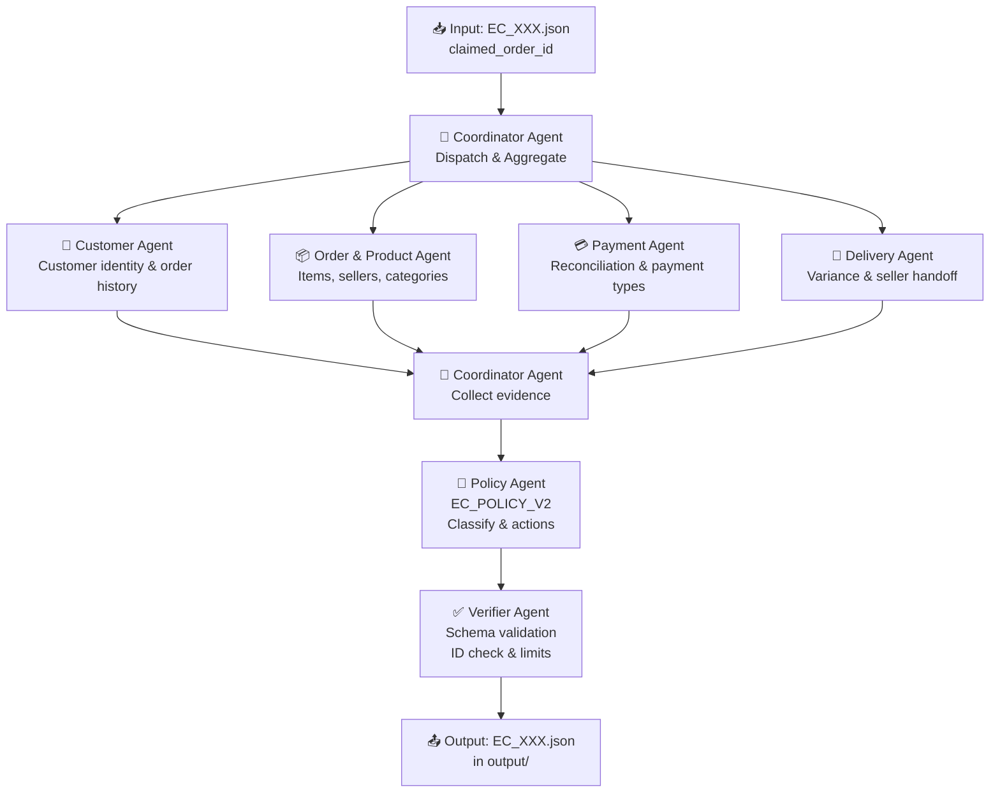

# Hệ thống Multi-Agent E-commerce Dispute Resolution

## Tổng quan bài toán

Xử lý **50 case khiếu nại** (EC_001 → EC_050) từ khách hàng Olist bằng kiến trúc multi-agent. Mỗi case cần:
1. Tra cứu đơn hàng từ 9 file CSV
2. Phân tích giao hàng, thanh toán, seller
3. Áp dụng policy `EC_POLICY_V2`
4. Xuất output JSON theo schema chuẩn

> [!IMPORTANT]
> **Ràng buộc quan trọng**: Mỗi agent chỉ được dùng model ≤ 10B parameters (local hoặc qua provider).

---

## Phân tích Input

Mỗi file `EC_XXX.json` đều có cùng cấu trúc:
```json
{
  "case_id": "EC_001",
  "customer_request": {
    "language": "vi",
    "message": "Hãy điều tra khiếu nại...",
    "claimed_order_id": "<olist_order_id>"
  },
  "investigation_scope": {
    "include_customer_history": true,
    "include_product_context": true
  },
  "policy_version": "EC_POLICY_V2"
}
```

Key lookup chính: `claimed_order_id` → join qua các CSV

---

## Dữ liệu (9 CSV files trong `data/`)

| File | Mô tả | Key field |
|------|--------|-----------|
| `olist_orders_dataset.csv` | Trạng thái đơn, timestamps | `order_id`, `customer_id` |
| `olist_order_items_dataset.csv` | Items, seller, freight | `order_id`, `seller_id` |
| `olist_order_payments_dataset.csv` | Payment rows | `order_id`, `payment_sequential` |
| `olist_customers_dataset.csv` | Thông tin khách hàng | `customer_id`, `customer_unique_id` |
| `olist_products_dataset.csv` | Thông tin sản phẩm | `product_id` |
| `olist_sellers_dataset.csv` | Thông tin seller | `seller_id` |
| `olist_order_reviews_dataset.csv` | Đánh giá | `order_id` |
| `olist_geolocation_dataset.csv` | Địa lý | `zip_code_prefix` |
| `product_category_name_translation.csv` | Dịch tên category | `product_category_name` |

---

## Kiến trúc Multi-Agent đề xuất



---

## Proposed Workflow (Step-by-step)

### Phase 0: Khởi tạo & Load data (1 lần duy nhất)
- Load toàn bộ 9 CSV vào memory (pandas DataFrames)
- Index theo `order_id` để lookup O(1)

### Phase 1: Coordinator nhận case
- Đọc `EC_XXX.json`
- Extract `claimed_order_id`
- Dispatch đồng thời 4 sub-agents (có thể parallel)

### Phase 2: 4 Sub-agents phân tích song song

**Customer Agent**
- Input: `customer_id` từ `orders`
- Join: `customers` → lấy `customer_unique_id`
- Query `orders` theo `customer_unique_id` → lịch sử orders
- Output: `{customer_unique_id, related_order_ids}`

**Order & Product Agent**
- Input: `order_id`
- Join: `order_items` → `products` → `product_category_name_translation`
- Collect: `item_ids`, `seller_ids`, `product_ids`, `category_names`
- Output: `{items[], sellers[], products[], categories[]}`

**Payment Agent**
- Input: `order_id`
- Query: `order_payments`
- Compute: `item_total`, `freight_total`, `expected_total`, `payment_total`, `difference_brl`
- Check: `reconciled = abs(difference_brl) <= 0.10`
- Output: `{payment_reconciliation}`

**Delivery Agent**
- Input: `order_id`
- Query: `orders` → timestamps
- Compute: `delivery_variance_hours = delivered - estimated`
- Compute per seller: `handoff_variance_hours = carrier_handoff - shipping_limit`
- Output: `{delivery_analysis, late_handoff_seller_ids}`

### Phase 3: Policy Agent
- Nhận evidence từ 4 agents
- Áp dụng EC_POLICY_V2 theo thứ tự ưu tiên:
  1. `canceled_order_paid` → full refund
  2. `unavailable_order_paid` → full refund
  3. `late_delivery_seller` → freight refund
  4. `late_delivery_logistics` → freight refund
  5. `valid_split_payment` → explain
  6. `unsupported_late_claim` → reject
- Xác định `secondary_issues`, `responsible_parties`, `evidence_ids`, `resolution_actions`

### Phase 4: Verifier Agent
- Kiểm tra schema compliance
- Enforce limits: ≤5 order IDs, ≤5 items, ≤3 sellers, ≤5 payments, ≤5 related orders, ≤20 evidence, ≤5 actions
- Validate timestamp format `YYYY-MM-DD HH:MM:SS`
- Validate evidence ID format
- Validate `confidence ∈ [0,1]`
- Write output JSON nếu pass

---

## Proposed Changes (Files cần tạo)

### Root structure
```
K4-Day9-Multi-Agent-A2A-release/
├── agents/
│   ├── coordinator.py       # Coordinator Agent
│   ├── customer_agent.py    # Customer Agent
│   ├── order_product_agent.py  # Order & Product Agent
│   ├── payment_agent.py     # Payment Agent
│   ├── delivery_agent.py    # Delivery Agent
│   ├── policy_agent.py      # Policy Agent
│   └── verifier_agent.py    # Verifier Agent
├── tools/
│   └── data_loader.py       # Load & index CSVs
├── main.py                  # Entry point: loop 50 cases
├── trace_writer.py          # Write trace.jsonl
├── metadata.json            # Model info
├── architecture.md          # [cần điền]
└── .env                     # API keys (không commit)
```

---

## Technology Stack đề xuất

| Thành phần | Lựa chọn |
|-----------|---------|
| Orchestration | **Google ADK** (Agent Development Kit) hoặc **LangGraph** |
| LLM | Gemma 3-9B hoặc Qwen2.5-7B (≤10B, local/API) |
| Data processing | `pandas` |
| Output validation | `pydantic` |
| Parallelism | `asyncio` hoặc `concurrent.futures` |

---

## Open Questions

> [!IMPORTANT]
> **Q1 - Framework**: Bạn muốn dùng framework nào để orchestrate agents?
> - Google ADK (A2A protocol)
> - LangGraph
> - CrewAI
> - Custom Python thuần

> [!IMPORTANT]
> **Q2 - Model**: Model ≤10B nào bạn có sẵn?
> - Gemma 3-9B (local via Ollama)
> - Qwen2.5-7B (local/API)
> - Llama 3.1-8B
> - Gọi API provider (Groq, Together AI...)

> [!WARNING]
> **Q3 - Parallel vs Sequential**: Chạy 50 cases theo:
> - **Sequential**: Đơn giản hơn, dễ debug, chậm hơn (~50x)
> - **Parallel**: Nhanh hơn, cần xử lý concurrency

> [!NOTE]
> **Q4**: Bạn có muốn mình bắt đầu code ngay từ `data_loader.py` và một case demo (EC_001) trước khi scale lên 50 không?

---

## Verification Plan

### Automated
- Chạy `main.py` với EC_001, kiểm tra output JSON khớp schema
- Unit test `verifier_agent.py` với edge cases (null items, split payment...)

### Manual
- Compare `output/EC_001.json` với ground truth về `primary_issue`, `refund_amount`
- Kiểm tra `trace.jsonl` có đủ 50 entries
